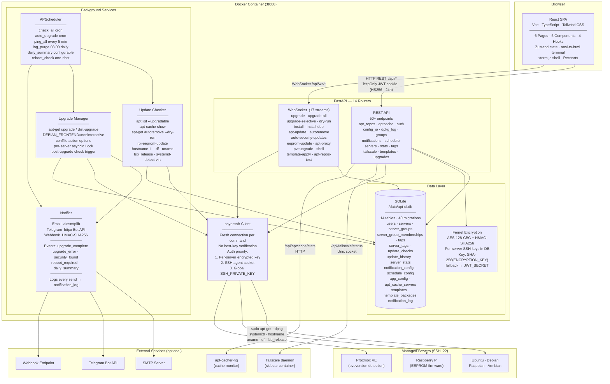
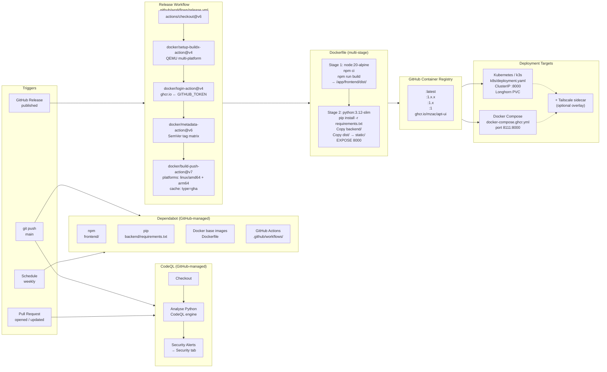

# Architecture

This document describes the application architecture and CI/CD pipeline for apt-ui.

---

## Application Architecture

### Diagram

---

### Frontend Layer

The frontend is a **React 18 SPA** built with Vite and TypeScript, served as static files from within the same Docker container. It never communicates with the backend at build time — the Vite dev proxy (`/api/* → :8000`) is used only during local development.

| Concern | Implementation |
|---|---|
| Routing | React Router v6, 5 route paths |
| State | Zustand (auth store, job store) |
| API calls | Typed fetch wrapper in `api/client.ts`; all requests carry `credentials: 'include'` for the JWT cookie |
| 401 handling | Any 401 response redirects to `/login?expired=1` |
| WebSockets | Factory functions per stream type; browser sends cookie automatically on WS handshake |
| Terminal output | `ansi-to-html` for coloured apt output; `@xterm/xterm` for the interactive SSH shell |
| Charts | Recharts (update trend over time on the Stats tab) |
| Theming | CSS custom properties in `index.css`; `html.light` class toggle; preference in `localStorage` |
| Dashboard polling | `usePolling` hook calls `GET /api/servers` every 30 s |

**Pages:**

| Page | Path | Primary purpose |
|---|---|---|
| Login | `/login` | JWT authentication, default-password banner |
| Dashboard | `/` | Fleet overview, server card grid, group filters, bulk actions |
| Server Detail | `/servers/:id` | Packages · Upgrade · Apt Repos · History · dpkg Log · Stats · Shell |
| Settings | `/settings` | Schedule, notifications, server/group management, backup, account |
| History | `/history` | Fleet-wide upgrade history + notification history (sub-tabs) |
| Templates | `/templates` | Named package sets; apply to one or more servers |
| Compare | `/compare` | Side-by-side installed package comparison across multiple servers |

---

### API Layer

FastAPI handles all HTTP traffic on port 8000 — both the REST API and static file serving. The React `index.html` is returned for any path not matched by an API route (SPA fallback).

**Authentication** uses a single `apt_ui_token` httpOnly cookie containing an HS256-signed JWT (24 h expiry). All `/api/*` routes except `/api/auth/login` and `/health` require a valid cookie via the `get_current_user` FastAPI dependency. WebSocket endpoints call `get_current_user_ws` during the handshake and close with code 1008 on failure.

**Router summary:**

| Router | Prefix | Key responsibility |
|---|---|---|
| `auth` | `/api/auth/` | Login · logout · me · change-password |
| `servers` | `/api/servers/` | CRUD · SSH test · reboot · check-all · reachability |
| `groups` | `/api/groups/` | Server group CRUD |
| `tags` | `/api/tags/` | Tag CRUD |
| `updates` | `/api/servers/` | Trigger check · fetch packages |
| `upgrades` | `/api/` | Upgrade · selective upgrade · install · .deb install · 15 WebSocket streams |
| `stats` | `/api/` | Fleet overview · paginated history |
| `scheduler` | `/api/scheduler/` | Read/update schedule config; reconfigures APScheduler jobs live |
| `notifications` | `/api/notifications/` | Read/update notification config; test email/Telegram; detect chat ID |
| `config_io` | `/api/config/` | JSON export/import · CSV export/import |
| `templates` | `/api/templates/` | Package template CRUD · apply via WebSocket |
| `aptcache` | `/api/aptcache/` | apt-cacher-ng server management · live stats |
| `tailscale` | `/api/tailscale/` | Query tailscaled Unix socket for connection status |
| `dpkg_log` | `/api/servers/` | On-demand dpkg.log + rotated archive parsing |
| `apt_repos` | `/api/servers/` | Read/write/delete apt source files; stream apt-get update |

---

### SSH Layer

All communication with managed servers goes through **asyncssh** with a fresh connection opened per command — there is no connection pool. This is intentional: the fleet is small (~20 servers) and short-lived connections are simpler and more resilient than pooling.

Connection options are resolved in `_connect_options(server)` with the following key priority:

1. **Per-server key** — decrypted from `Server.ssh_private_key_enc` using Fernet
2. **SSH agent** — via `SSH_AUTH_SOCK` environment variable
3. **Global key** — from `SSH_PRIVATE_KEY` environment variable

Host key verification is disabled (`known_hosts=None`). This is a deliberate trade-off: the tool is designed for use on a trusted LAN where maintaining a host key database across a fleet would be impractical.

**Command types used on managed servers:**

| Category | Commands |
|---|---|
| Package management | `apt-get update`, `apt-get upgrade`, `apt-get dist-upgrade`, `apt-get autoremove`, `apt-get install`, `dpkg -i`, `apt-cache show/search`, `apt-mark showhold`, `dpkg-query -W` (package comparison), `pveupgrade --force` (Proxmox VE) |
| System info | `uname -r`, `uptime`, `df -h /`, `dpkg --list`, `lsb_release`, `hostname -I`, `systemd-detect-virt`, `pveversion` |
| File operations | `cat /etc/apt/sources.list*`, `sudo tee`, `sudo rm` |
| Service control | `sudo reboot`, `unattended-upgrades`, `rpi-eeprom-update` |
| Checks | `ls /var/run/reboot-required`, `stat /var/cache/apt/pkgcache.bin` |

---

### Background Services

#### APScheduler

Five recurring jobs and one on-demand job type run on the `AsyncIOScheduler`, all scoped to the timezone defined by the `TZ` environment variable.

| Job | Trigger | What it does |
|---|---|---|
| `check_all` | Cron (default `0 6 * * *`) | Checks all enabled servers; fires security/reboot notifications; sends daily summary |
| `auto_upgrade` | Cron (configurable, disabled by default) | Upgrades all servers with pending updates up to the concurrency limit |
| `ping_all` | Every 5 minutes | TCP-connects to each server's SSH port (3 s timeout); updates `is_reachable` + `last_seen` without SSH |
| `log_purge` | Daily at 03:00 | Deletes `update_checks`, `update_history`, `server_stats`, and `notification_log` records older than `log_retention_days` |
| `daily_summary` | Time-of-day (default 07:00) | Sends fleet summary across enabled channels |
| `reboot_check_{id}` | One-shot (post-reboot delay) | Polls until the server responds, then triggers a check |

Schedule and notification config changes made in the UI take effect immediately — the scheduler is reconfigured live without a restart.

#### Update Checker

For each server, a single check collects in parallel over SSH:
- Upgradable packages (`apt list --upgradable` → parsed with security/phased/held classification)
- Package descriptions (`apt-cache show --no-all-versions`)
- Autoremove candidates (`apt-get autoremove --dry-run`)
- System stats (uptime, kernel, disk, RAM, CPU, package count, virt type)
- Reboot-required flag (`/var/run/reboot-required`)
- EEPROM firmware status (Raspberry Pi 4/400/CM4/5 only)
- Last `apt-get update` timestamp
- apt HTTP proxy (`apt-config dump` + `/etc/apt/apt.conf.d/` scan)

Results are stored in `update_checks` and `server_stats`. The `packages_json` field caches parsed package data as JSON to avoid re-parsing on every API call.

#### Upgrade Manager

Each upgrade acquires a **per-server `asyncio.Lock`** from an in-memory dict to prevent concurrent upgrades on the same server. The lock resets on container restart.

Upgrade commands are constructed server-side and never interpolate raw user input into shell strings. The conffile action (`confdef_confold` / `confold` / `confnew`) and phased-update flag are the only user-controlled parameters, and they map to a fixed set of `apt-get` options.

#### Notifier

Three outbound channels, each independently toggleable per event type:

| Channel | Implementation | Signature |
|---|---|---|
| Email | aiosmtplib, STARTTLS or SSL, HTML + text fallback | — |
| Telegram | httpx POST to Bot API, splits messages >4000 chars | — |
| Webhook | httpx POST, JSON payload, optional `X-Hub-Signature-256` HMAC-SHA256 header | `webhook_secret` env |

Events: `upgrade_complete`, `upgrade_failed`, `security_updates_found`, `reboot_required`, `daily_summary`.

---

### Data Layer

The SQLite database lives at `/data/apt-ui.db` inside the container (mounted as a Docker volume). SQLAlchemy async is used throughout the API layer; the CLI tool uses synchronous SQLAlchemy.

Schema changes are applied at startup via a hand-maintained list of `ALTER TABLE` statements in `init_db()`. Errors are silently swallowed, so the same list is safe against both fresh installs and existing databases.

**Core tables:**

| Table | Purpose |
|---|---|
| `users` | Authentication; bcrypt-hashed passwords |
| `servers` | Managed server inventory; encrypted per-server SSH keys; `is_reachable` + `last_seen` from ping job |
| `server_groups` | Colour-coded grouping |
| `server_group_memberships` | Many-to-many servers ↔ groups |
| `tags` | Freeform tags; auto-created by OS/virt detection |
| `server_tags` | Many-to-many servers ↔ tags |
| `update_checks` | Results of each apt check per server |
| `update_history` | Upgrade run records with full log output |
| `server_stats` | Hardware stats, kernel, EEPROM state, apt proxy URL per check |
| `notification_config` | Single-row app-wide notification settings |
| `schedule_config` | Single-row scheduling and behaviour settings |
| `app_config` | Key-value store (JWT secret persistence) |
| `apt_cache_servers` | apt-cacher-ng server definitions |
| `templates` / `template_packages` | Named package sets for bulk provisioning |
| `notification_log` | Record of every outbound notification (channel, event type, summary, success/error) |

---

## CI/CD Pipeline

### Diagram

---

### Pipeline Explanation

#### Code Scanning (CodeQL)

GitHub's managed CodeQL workflow runs on every push to `main` and on every pull request. It analyses the Python backend for security issues using the CodeQL engine. Alerts appear in the repository's **Security → Code scanning** tab. The workflow is GitHub-managed and does not live in `.github/workflows/`.

Current rules applied: `py/full-ssrf`, `py/stack-trace-exposure`, and the full Python security query suite.

#### Dependabot

GitHub's managed Dependabot monitors four dependency ecosystems on a weekly schedule:

| Ecosystem | Scope |
|---|---|
| `npm` | `frontend/package-lock.json` |
| `pip` | `backend/requirements.txt` |
| `docker` | `Dockerfile` base images |
| `github-actions` | `.github/workflows/*.yml` action versions |

Dependabot opens pull requests automatically. These trigger the CodeQL workflow for additional vetting before merge.

#### Release Workflow

Triggered by a **published GitHub Release**. All steps run on `ubuntu-latest`.

1. **Checkout** — full source checkout
2. **Buildx** — sets up Docker Buildx with QEMU for cross-platform compilation
3. **Login** — authenticates to `ghcr.io` using the ephemeral `GITHUB_TOKEN` (no stored secrets needed)
4. **Metadata** — generates four image tags from the release's Git tag using SemVer patterns
5. **Build & Push** — compiles both `linux/amd64` and `linux/arm64` images in a single pass using GitHub Actions cache to speed up layer reuse between releases

#### Dockerfile (multi-stage)

The build is split into two stages to keep the final image small:

- **Stage 1 (`node:20-alpine`)** — installs Node.js dependencies with `npm ci` (reproducible from `package-lock.json`) and produces the compiled React SPA in `dist/`
- **Stage 2 (`python:3.12-slim`)** — installs Python dependencies, copies the backend, and copies the compiled frontend from Stage 1 into `static/`. FastAPI serves these static files directly with a SPA catch-all route.

The result is a single self-contained image with no Node.js runtime in production.

#### Deployment

| Target | Manifest | Notes |
|---|---|---|
| Docker Compose | `docker-compose.ghcr.yml` | Pulls `:latest` from GHCR; maps `8111:8000`; mounts named volume for `/data` |
| Kubernetes / k3s | `k8s/deployment.yaml` | 1-replica Deployment; ClusterIP Service; Longhorn PVC for `/data`; liveness + readiness on `GET /health`; resource limits 256Mi / 500m CPU |
| Tailscale | `docker-compose.tailscale.yml` overlay | Optional sidecar; shares network namespace with app container; provisions automatic HTTPS via `tailscale serve` |

Build-from-source is also supported via `./build-run.sh` for local development.
