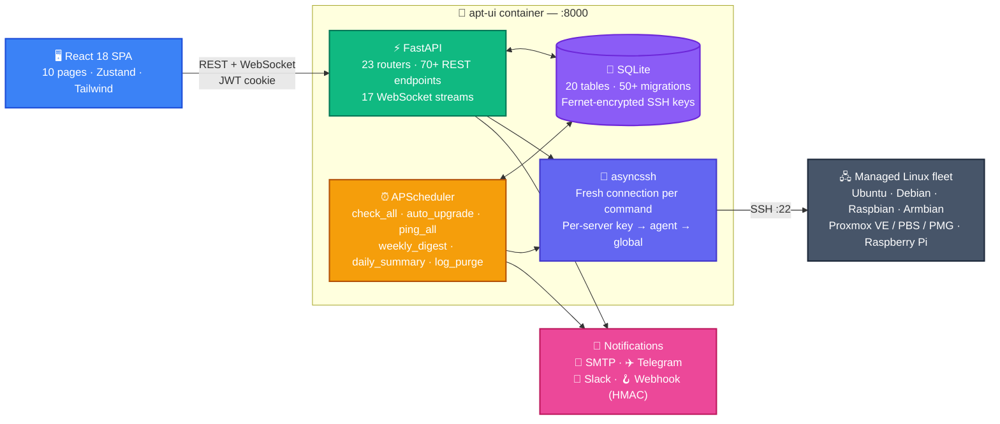

<h1 align="center">⬡ apt-ui</h1>

<p align="center">
  <strong>Self-hosted apt fleet manager — one dashboard, every server, real terminal output.</strong><br/>
  A focused alternative to AWX / Ansible Tower for Ubuntu, Debian, Raspbian, and Proxmox fleets.
</p>

<p align="center">
  <a href="https://github.com/mzac/apt-ui/actions/workflows/release.yml"></a>
  <a href="https://github.com/mzac/apt-ui/security/code-scanning"></a>
  <a href="https://github.com/mzac/apt-ui/blob/main/LICENSE"></a>
  
</p>

<p align="center">
  <a href="https://github.com/mzac/apt-ui/releases/latest"></a>
  <a href="https://github.com/mzac/apt-ui/commits/main"></a>
  <a href="https://github.com/mzac/apt-ui/issues"></a>
  <a href="https://github.com/mzac/apt-ui/stargazers"></a>
</p>

<p align="center">
  
  
  
  
  
  
</p>

<p align="center">
  
  
  
  
  
</p>

<p align="center">
  
  
  
  
  
</p>

<p align="center">
  <a href="ARCHITECTURE.md">📐 Architecture</a> ·
  <a href="SECURITY.md">🔒 Security</a> ·
  <a href="CHANGELOG.md">📋 Changelog</a> ·
  <a href="https://github.com/mzac/apt-ui/releases">📦 Releases</a>
</p>

---

<p align="center">
  
</p>

---

> 🤖 **This project was entirely written by [Claude](https://claude.ai) (Anthropic's AI assistant) via [Claude Code](https://claude.ai/code).** All code, configuration, and documentation — from the FastAPI backend and asyncssh integration to the React frontend and Docker setup — was generated through an iterative, conversation-driven development process with no manual coding.

---

## Why apt-ui

**The fleet is the unit, not the host.** Most apt UIs are per-server. apt-ui treats your Ubuntu / Debian / Raspbian / Proxmox fleet as one thing — Check All, Upgrade All, Reboot All, Autoremove All all multiplexed into one terminal stream with per-server filter chips and live status. No more SSH'ing to twelve boxes to roll a security patch.

**One container, zero agents.** Single Docker image (under 250 MB). Talks to managed servers over plain SSH — no daemons on the targets, no message bus, no Postgres, no Redis. The whole control plane is FastAPI + SQLite + APScheduler, designed to run on a Pi 4 and manage 50 servers comfortably.

**Built for staged rollouts.** Tag servers with `ring:test` / `ring:prod` and auto-upgrade promotes through them in alphabetical ring order, aborting the rollout if any host fails. Maintenance windows block scheduled work outside approved hours. Pre/post-upgrade hooks let you take a BTRFS / ZFS snapshot first. Rolling reboot orchestrates kernel reboots in batches with reachability checks between them.

**Security-aware, not just scheduling.** A daily CVE matcher annotates every pending package with USN / CVE-IDs sourced from the Ubuntu USN database. The fleet-wide CVE inventory pivots that data into "which hosts are exposed to CVE-2025-XXXXX." A Prometheus `/metrics` endpoint feeds Grafana. Notifications cover daily summaries, weekly digests, security alerts, and reboot-required events across email / Telegram / Slack / webhook. Auth includes TOTP 2FA, scrypt-hashed API tokens, and admin / read-only RBAC.

---

## What's in the box

> One single-container control plane for an apt fleet — fleet-wide actions, scheduled automation, security visibility, and integrations to keep it honest.

### 📦 Fleet management

| | Feature | Highlights |
|---|---|---|
| 🗺 | **Dashboard & fleet view** | server card grid · update / security / reboot / autoremove counts · clickable filters · search across hostnames + tags |
| 🏷 | **Groups & tags** | colour-coded groups (many-to-many) · freeform tags · auto-tagging by OS and virt type · ring tags drive staged rollouts |
| ⚡ | **Fleet-wide actions** | Check All · Refresh All · Upgrade All · Autoremove All · Rolling Reboot — all multiplexed via WebSocket with per-server filter chips |
| 📡 | **Reachability monitor** | TCP ping every 5 minutes (independent of SSH) · offline servers dimmed and banner-flagged · `is_reachable` + `last_seen` per server |
| 🐳 | **Docker host detection** | identifies the host running the dashboard and blocks upgrades of container-runtime packages mid-flight |
| 🔍 | **Fleet-wide package search** | five match modes (exact / contains / starts-with / ends-with / regex) · pivoted CVE-style table · diverged-version highlight |
| ⚖️ | **Multi-server compare** | side-by-side installed-package inventory across any combination of servers · Diverged / Common / All filter modes |

### 🔄 Update & upgrade

| | Feature | Highlights |
|---|---|---|
| 📋 | **Upgradable list** | full version deltas · repo source · security flag · phased-update column · package descriptions on hover |
| 🎯 | **Selective upgrade** | check the boxes for individual packages instead of upgrading everything |
| 🐛 | **Dist-upgrade detection** | parallel `apt-get dist-upgrade --dry-run` surfaces new dependency packages and "kept back" rows that plain `upgrade` would skip |
| 🖥 | **Live terminal** | WebSocket stream of `apt-get` output with carriage-return progress lines updating in place; ANSI colour preserved |
| 📦 | **Package install** | search the apt cache and install new packages on any host from the UI |
| 💿 | **.deb installs** | URL (validated, `wget`-pulled) or browser upload (SFTP'd via asyncssh) — both stream `dpkg -i` + `apt-get install -f` live |
| 🧱 | **Templates** | named package sets applied to one or more hosts in one click — useful for provisioning identical roles |
| 📌 | **Held packages** | per-package hold / unhold from the Packages tab; held-package chips with one-click ✕ unhold |
| 📝 | **Apt sources editor** | tabbed editor for `/etc/apt/sources.list*` files · save / delete / create · "Test with apt-get update" streams live |

### 🛡 Security

| | Feature | Highlights |
|---|---|---|
| 🛡 | **CVE matcher** | daily Ubuntu USN sync · per-package severity-coloured 🛡 badge · USN + CVE links in tooltips |
| 🚨 | **Fleet CVE inventory** | `/security` page pivots CVE → servers · severity / status / group filters · CSV export · nav badge with critical-CVE count |
| 🔐 | **Per-server SSH keys** | Fernet-encrypted in DB · falls back to global `SSH_PRIVATE_KEY` or `SSH_AUTH_SOCK` |
| 🛡 | **Auto security updates** | per-server `unattended-upgrades` toggle with shield-badge state · streams live SSH output when toggling |
| 🔢 | **TOTP 2FA** | QR enrolment in Settings → Account · login flow asks for a 6-digit code when enabled |
| 🔑 | **API tokens** | `aptui_<32 url-safe bytes>` format · scrypt-hashed · raw value shown only once · for `curl` / CI / scripts |
| 👥 | **RBAC** | admin / read-only roles · `require_admin` on ~28 mutation endpoints · "read-only" badge in the nav |

### ⏰ Automation & scheduling

| | Feature | Highlights |
|---|---|---|
| 🗓 | **Scheduled checks** | configurable cron for fleet-wide update checks |
| 🤖 | **Auto-upgrade** | optional hands-off upgrades on a schedule · concurrency cap · phased-update toggle · conffile-action choice |
| 🚦 | **Maintenance windows** | global or per-server time windows where auto-upgrades are blocked · midnight-wrap · iCal feed for ops calendars |
| 🪝 | **Pre/post-upgrade hooks** | shell commands run before / after every upgrade · pre-hook failure aborts · global or per-server scope |
| 🎟 | **Staged rollout (rings)** | `ring:*` tags promote upgrades through environments in alphabetical order · per-batch failure aborts the rollout |
| 🔁 | **Rolling reboot** | fleet-wide reboot of `reboot_required` servers in ring order with per-batch waits and reachability checks |
| 🐧 | **Reboot-after-upgrade** | optional checkbox auto-reboots after a successful upgrade if `/var/run/reboot-required` exists |

### 🔔 Notifications

| | Channel | Notes |
|---|---|---|
| 📧 | **Email** | aiosmtplib · STARTTLS / SSL · HTML + text fallback |
| ✈️ | **Telegram** | Bot API · auto-chunk for messages over 4 K |
| 💬 | **Slack** | incoming webhook · Block Kit messages with header + section blocks |
| 🪝 | **Webhook** | JSON POST · optional `X-Hub-Signature-256` HMAC-SHA256 |
| | | |
| 🗓 | **Events** | upgrade complete · upgrade error · security updates found · reboot required · daily summary · weekly digest |
| 🎚 | **Per-channel × per-event toggles** | independently enable each event on each channel |
| 📅 | **Weekly patch digest** | opt-in summary on a configurable cron · headline counters · by-server table · still-pending list · CVE summary · health flags |
| 📜 | **Notification log** | every send recorded — channel, event, summary, success/failure |

### 🔭 Visibility & reporting

| | Feature | Highlights |
|---|---|---|
| 📜 | **Upgrade history** | per-server and fleet-wide log · filterable by server / status · full terminal output expandable per run |
| 🔍 | **SSH audit log** | every command apt-ui dispatches recorded (command, exit, duration, 4 KB output excerpt) · sub-tab in History |
| 🗒 | **dpkg log** | parses `/var/log/dpkg.log` + rotated `.gz` archives · filter by package / action / time |
| 📊 | **Reports** | Patch Coverage · Upgrade Success Rate · Security SLA — all CSV-exportable |
| 📈 | **Prometheus /metrics** | fleet-state counters / gauges for Grafana · optional `METRICS_TOKEN` bearer auth |
| 🌐 | **Public /status.json** | opt-in fleet health snapshot for embedding · disabled by default |
| 📅 | **iCal feed** | subscribable maintenance-window calendar at `/api/calendar.ics?token=…` |
| 🕒 | **OS EOL countdown** | dashboard 🕒 badge when OS reaches end-of-life within 365 days · severity-coloured · ESM note for Ubuntu LTS |

### 🧰 Server detail

> Each managed server gets its own page with tabs:

`Packages` · `Upgrade` · `Health` · `Apt Repos` · `dpkg Log` · `History` · `Stats` · `Shell`

| | Feature | Highlights |
|---|---|---|
| 🐧 | **OS detection** | Ubuntu · Debian · Raspbian · Armbian · Proxmox VE · Proxmox Backup Server · Proxmox Mail Gateway · bare-metal / VM / LXC / Docker via `systemd-detect-virt` |
| 🔶 | **Proxmox VE awareness** | dedicated `pveupgrade` button · PVE-managed packages highlighted in the Packages tab |
| 🏥 | **Health panel** | on-demand probe of `systemctl --failed`, last 20 boot-priority `journalctl` errors, recent reboot history · restart-service per failed unit |
| 🍓 | **Raspberry Pi EEPROM** | firmware update detection for Pi 4 / 400 / CM4 / 5 · one-click apply |
| 💾 | **Disk + boot health** | red badge when `/boot` free < 100 MB or < 10% · kernel install date with 60d / 180d age tinting |
| 📸 | **Snapshot capability** | BTRFS / ZFS / LXC detected · banner with copy-pastable pre-hook command suggestion in the Upgrade tab |
| ⚡ | **apt proxy** | detect + manage `apt-cacher-ng` proxy or `auto-apt-proxy` · live SSH output when toggling |

### 🚀 Deployment

| | Path | Status |
|---|---|---|
| 🐳 | **Docker Compose** | `docker compose up -d` — `docker-compose.ghcr.yml` pulls the prebuilt image |
| ☸️ | **Kubernetes** | `k8s/deployment.yaml` — Deployment + ClusterIP Service + Longhorn PVC |
| 🌐 | **Tailscale sidecar** | optional overlay — joins the container/pod to your tailnet · automatic HTTPS via `tailscale serve` |
| 🛠 | **Build from source** | `./build-run.sh` — dev workflow with hot rebuild |
| 🏗 | **Multi-arch images** | `linux/amd64` + `linux/arm64` published to GHCR every release |

---

## Quick start

> ⚠️ Requires Docker + Docker Compose v2 and SSH access to the target servers.

### 1. Set up your `.env`

```bash
cat > .env <<EOF
SSH_PRIVATE_KEY="$(cat ~/.ssh/id_ed25519)"

# Optional but recommended — fixes JWT secret so sessions survive restarts
JWT_SECRET=$(openssl rand -hex 32)

# Optional overrides
# TZ=America/Montreal
# LOG_LEVEL=INFO
EOF
```

The key must be inside double quotes with literal newlines preserved (the heredoc above handles this).

### 2a. Run from pre-built image (recommended)

```bash
docker compose -f docker-compose.ghcr.yml up -d
```

To pin to a specific release instead of `latest`, edit `docker-compose.ghcr.yml` and change the image tag, e.g. `ghcr.io/mzac/apt-ui:2026.05.01-03`.

### 2b. Build from source

```bash
./build-run.sh
```

The app will be available at **http://localhost:8111**.

Default login: `admin` / `admin` — **change this immediately** via Settings → Account.

---

## SSH authentication

Two approaches. Pick whichever fits your setup.

### Option A — SSH directly as root (simplest)

If root has a password set the account is active and you can add your public key:

```bash
# Run on each managed server
sudo mkdir -p /root/.ssh
sudo cat ~/.ssh/id_ed25519.pub >> /root/.ssh/authorized_keys
sudo chmod 600 /root/.ssh/authorized_keys
```

Then set `username = root` when adding each server in the dashboard. No sudo configuration required.

### Option B — Regular user with passwordless sudo for apt-get

```bash
# Run on each managed server
echo "youruser ALL=(ALL) NOPASSWD: /usr/bin/apt-get" | sudo tee /etc/sudoers.d/apt-ui
```

### Key delivery

| Mode | When to use |
|---|---|
| **Inline `SSH_PRIVATE_KEY`** | simplest; key must have no passphrase |
| **`SSH_AUTH_SOCK` (agent)** | passphrase-protected key; forwards your host's agent into the container — the key never leaves your host |
| **Per-server key in DB** | upload a dedicated key per managed server via the Add Server form; Fernet-encrypted at rest |

---

## Configuration

All runtime configuration (SMTP / Telegram / Slack / schedules / server list / users) is managed in the web UI and stored in the SQLite database at `/data/apt-ui.db`. **No restart required to change settings.**

| Variable | Default | Description |
|---|---|---|
| `SSH_PRIVATE_KEY` | — | Full PEM content of the private key. Required unless using SSH agent. |
| `SSH_AUTH_SOCK` | — | Path to SSH agent socket inside the container (e.g. `/run/ssh-agent.sock`). Alternative to `SSH_PRIVATE_KEY` — allows passphrase-protected keys. |
| `JWT_SECRET` | random | JWT signing secret. Set to persist sessions across restarts. |
| `ENCRYPTION_KEY` | — | Master key used to encrypt per-server SSH keys in the DB. Falls back to `JWT_SECRET`. |
| `DATABASE_PATH` | `/data/apt-ui.db` | SQLite file path. |
| `TZ` | `America/Montreal` | Timezone for scheduled jobs. |
| `LOG_LEVEL` | `INFO` | Python log level. |
| `ENABLE_TERMINAL` | `false` | Set `true` to enable the interactive SSH shell tab. Only enable for trusted users. |
| `METRICS_TOKEN` | — | Optional bearer token to protect the `/metrics` endpoint. If unset the endpoint is unauthenticated. |
| `STATUS_PAGE_PUBLIC` | `false` | Set `true` to enable the unauthenticated `/status.json` fleet health endpoint. |
| `STATUS_PAGE_SHOW_NAMES` | `false` | Include server names (not hostnames) in `/status.json`. |
| `STATUS_PAGE_TITLE` | `apt-ui Fleet Status` | Custom title returned by `/status.json`. |

---

## CLI tool

Admin operations can be run from inside the container:

```bash
# Reset password (interactive prompt)
docker compose exec apt-ui python -m backend.cli reset-password

# Reset password inline
docker compose exec apt-ui python -m backend.cli reset-password --username admin --password newpass123

# Create a user (admin by default; --readonly for non-admin)
docker compose exec apt-ui python -m backend.cli create-user --username zac --password mypass

# List all users
docker compose exec apt-ui python -m backend.cli list-users
```

---

## Tailscale

The dashboard can join your [Tailscale](https://tailscale.com) tailnet via an optional sidecar container. This gives you:

- Secure remote access without exposing a port to the public internet
- Automatic HTTPS with a Let's Encrypt cert via `tailscale serve`
- Connection status (tailnet IP, hostname, DNS name) visible in Settings → Infrastructure
- Works the same way in Kubernetes — the sidecar joins the pod to the tailnet

### Enable Tailscale (Docker Compose)

Add to your `.env`:

```
TS_AUTHKEY=tskey-client-...   # generate at tailscale.com/settings/keys
TS_HOSTNAME=apt-ui            # how it appears on your tailnet
```

Run with the overlay:

```bash
docker compose -f docker-compose.yml -f docker-compose.tailscale.yml up -d
```

Tailscale runs as a separate `tailscale/tailscale:latest` container, **not baked into the app image** — `docker compose pull` updates it independently of the app.

### Enable `tailscale serve` (HTTPS on your tailnet)

`tailscale serve` proxies HTTPS `:443` → app `:8000` and provisions a Let's Encrypt cert automatically for your node's DNS name (e.g. `apt-ui.your-tailnet.ts.net`).

In `docker-compose.tailscale.yml`, uncomment the two lines under the `tailscale` service:

```yaml
- TS_SERVE_CONFIG=/serve-config.json
- ./tailscale-serve.json:/serve-config.json:ro
```

The bundled `tailscale-serve.json` uses `${TS_CERT_DOMAIN}` which the Tailscale container resolves to your node's DNS name at runtime.

---

## Kubernetes

A ready-to-use manifest is provided at [`k8s/deployment.yaml`](k8s/deployment.yaml):

- 1-replica Deployment
- ClusterIP Service on port 8000
- PersistentVolumeClaim (Longhorn storage class — change if needed)
- Secret references for `SSH_PRIVATE_KEY` and `JWT_SECRET`
- Liveness + readiness probes against `GET /health`
- Resource limits: 128–256 Mi RAM, 100m–500m CPU

```bash
# Create the secret
kubectl create secret generic apt-ui-secrets \
  --from-literal=ssh-private-key="$(cat ~/.ssh/id_rsa)" \
  --from-literal=jwt-secret="$(openssl rand -hex 32)"

# Deploy
kubectl apply -f k8s/deployment.yaml
```

The manifest also has a ready-to-uncomment Tailscale sidecar block — uncomment it and add the auth key to the secret:

```bash
kubectl create secret generic apt-ui-secrets \
  --from-literal=ssh-private-key="$(cat ~/.ssh/id_rsa)" \
  --from-literal=jwt-secret="$(openssl rand -hex 32)" \
  --from-literal=ts-authkey="tskey-client-..."
```

---

## Architecture



> See [ARCHITECTURE.md](ARCHITECTURE.md) for full diagrams, request-flow details, data model, and CI/CD pipeline documentation.

### Tech stack

| Layer | Library / Tool |
|---|---|
| **Backend** | Python 3.12 · FastAPI · Uvicorn |
| **Auth** | passlib[bcrypt] · PyJWT (HS256, 24 h httpOnly cookie) · pyotp (TOTP) · scrypt (API tokens) |
| **SSH** | asyncssh — fresh connection per command, `known_hosts=None` (trusted LAN) |
| **Encryption** | Fernet (AES-128-CBC + HMAC-SHA256) — per-server SSH keys + TOTP secrets at rest |
| **Database** | SQLite · SQLAlchemy 2.x async · aiosqlite |
| **Scheduler** | APScheduler 3.x AsyncIOScheduler — live reconfiguration, no restart needed |
| **Notifications** | aiosmtplib (email) · httpx (Telegram / Slack / webhook with HMAC-SHA256) |
| **Frontend** | React 18 · TypeScript · Vite · Tailwind CSS |
| **State** | Zustand (auth + job store + servers store) |
| **Charts** | Recharts |
| **Terminal** | ansi-to-html (apt output) · @xterm/xterm (interactive shell) |
| **Container** | Multi-stage Dockerfile — `node:20-alpine` build → `python:3.12-slim` runtime |
| **Registry** | GitHub Container Registry — `linux/amd64` + `linux/arm64` |
| **CI/CD** | GitHub Actions · CodeQL · Dependabot · multi-arch release pipeline |

---

## Development

### Backend

```bash
python -m venv venv && source venv/bin/activate
pip install -r backend/requirements.txt

export SSH_PRIVATE_KEY="$(cat ~/.ssh/id_rsa)"
export DATABASE_PATH="./data/dev.db"
export PYTHONPATH=$(pwd)
uvicorn backend.main:app --reload --port 8000
```

### Frontend

```bash
cd frontend
npm ci
npm run dev   # Vite dev server on :5173, proxies /api/* to :8000
```

### Local CI

```bash
make ci      # mirrors GitHub Actions: Python syntax + import check + frontend build
make venv    # bootstrap a Python venv
make help    # list all targets
```

---

## Project status

apt-ui ships on a **calendar versioning** cadence (`YYYY.MM.DD-NN`) — releases happen when a wave of features is ready, not on a fixed schedule. Every release publishes multi-arch (`linux/amd64` + `linux/arm64`) images to GHCR.

| Area | Status |
|---|---|
| Core fleet management (Check / Upgrade / Reboot / Autoremove All, dashboard, groups, tags) | ✅ Stable |
| Auth + RBAC + 2FA + API tokens | ✅ Stable |
| Notifications (email / Telegram / Slack / webhook · daily summary · weekly digest) | ✅ Stable |
| Maintenance windows · pre/post hooks · staged rollouts · rolling reboot | ✅ Stable |
| CVE matcher + fleet CVE inventory + Prometheus `/metrics` + status page | ✅ Stable |
| dpkg log · upgrade history · SSH audit log · reports (Patch Coverage / Success Rate / Security SLA) | ✅ Stable |
| Proxmox VE / PBS / PMG awareness · Raspberry Pi EEPROM · OS EOL countdown | ✅ Stable |
| Deployment: Docker Compose · Kubernetes · Tailscale sidecar | ✅ Stable |
| WebAuthn / passkeys | ⛔ Out of scope (TOTP covers the 2FA need; WebAuthn requires HTTPS + stable origin which homelab apt-ui rarely has) |
| Full automated snapshot/rollback | ⛔ Out of scope (snapshot capability + banner shipped; full automation deferred — pre-upgrade hooks let users wire whatever fits their layout) |

See [CHANGELOG.md](CHANGELOG.md) for the per-release feature list.

---

## Documentation

| Document | Description |
|---|---|
| [ARCHITECTURE.md](ARCHITECTURE.md) | Full architecture diagram, router → file map, data model, CI/CD pipeline |
| [CHANGELOG.md](CHANGELOG.md) | Per-release feature list and bug-fix history |
| [SECURITY.md](SECURITY.md) | Security policy, vulnerability disclosure, threat model notes |
| [CLAUDE.md](CLAUDE.md) | Authoritative spec for future Claude Code sessions |

---

## License

Released under the [MIT License](LICENSE).

---

<p align="center">
  Built with ❤️ by Claude — entirely AI-written via <a href="https://claude.ai/code">Claude Code</a>.
</p>
